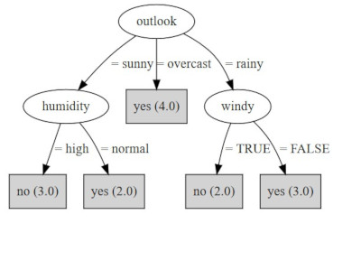

# Custom J48

Custom J48 is an extension of the J48 class of the [Weka library](https://www.cs.waikato.ac.nz/ml/weka/) part of a Bachelor thesis project regarding the creation of chatbots. J48 is a java implementation of the C4.5 machine learning algorithm.

The goal of this extension was to add the ability to export the generated decision trees in multiple formats, used then for the creation of a chatbot application, adding also a pruning ability and the possibility to use the empty string as a concrete value.

## Export formats

Trees generated using the J48 class can be exported in three different formats:

- GraphML format, whose specification can be found [here](http://graphml.graphdrawing.org/), with some graphical adjustments that allow a correct visualization using the yED editor (accessible also in a [browser live version](https://www.yworks.com/yed-live/)). 
- DOT format, used also as default by Weka
- JSON format, based on the following specification: 

```
    {
    "label": "node1", 
    "children": [
        { 
            "edgeLabel": "to_node_2", 
            "label": "node2"
        },
        { 
            "edgeLabel": "to_node_3", 
            "label": "node_3", 
            "children" […]
        }
    ]
	}
```

The tree is specified in a recursive way, where each node, except the leafs, contains the list of      its children nodes. Moreover, every node has a label attribute specifying the attribute used to split the data at the given point. All nodes (except the root) have an edgeLabel property, which represents the label of the edge from the parent node.

Trees exported using the described JSON format can be used directly as input of the chatbot interpreter, the second software part of the Bachelor Thesis, that can be found [at this address](https://gitlab.inf.unibz.it/Davide.Sbetti/bot_interpreter). 

Independently from the chosen export format, it is possible to activate the pruning and empty string capabilities.

## Pruning feature

In the scope of our project, the pruning capability was necessary because the algorithm, given an attribute, adds an edge labelled with any value that it is able to find for the given attribute in the whole data set, although possibly no instances reach that node, an intended behaviour used by C4.5 to avoid overfitting. 

However, in our chatbot creation case, we assumed that the data set contains all possible legal combinations and therefore, such branches, were not desired and would have led to a misleading tree. For this reason, the different export functions that were encoded allow a parameter that enables the pruning of branches reached by no instances as soon as they are discovered.

## Empty string replacement

Another aspect we had to consider, in our project, was the usage of the empty string in a CSV data set. Weka usually considers the empty string the same as a question mark, which is used to represent missing values. In our case, the empty string was an actual value and its interpretation as missing value would have led to a misleading tree. This clearly applies only in case of CSV files, since the ARFF format enforce the declaration of all possible values for categorical attributes and the empty string is not allowed.  

In fact, when encountering an instance with a missing value, Weka splits it making it a fractional instance of every possible value available for the attribute, which is clearly different than having an empty string as an independent value. 

Our implementation pre-processes the data set, replacing every empty string (also strings made up by only spaces) with the underscore character. A standard decision tree is then created and, while exporting, the underscores are then replaced back with the empty string.

Please note how, when this option is active and an attribute that already has a single underscore as value is encountered, the application will throw an exception. Moreover, in order to apply the pre-process of the data set, this should be encoded in the utf-8 format.

## Installation

There are two ways to use this application: 

1. If you do not need to modify the sources of the application you can simply use the compiled JAR that you can find 
here on GitLab at the following address [address goes here]. Once downloaded, you can simply launch it with the java command `java -jar customJ48.jar -d your_data set` specifying after the name of the file the desired options (more on that in the [Usage section](#usage)).

2. On the other hand, if you would like to modify the source code, feel free to do it! The J48 application requires Weka 3.8.3 stable. Dependencies have all been managed using Maven and therefore you can install and run the software following these steps:
	1. Make sure that you have Maven installed. If that is not the case, you can download the latest version from the [Maven website](https://maven.apache.org/). 
	2. Clone this repository to your local folder
	3. Modify the sources as needed
	4. Run the software using either your IDE (but please, remember to pass the necessary console arguments as explained in the [Usage section](#usage)) or generate your compiled JAR, containing all the required dependencies in one package,  with the following command: `mvn clean compile assembly:single`. For more instructions on the precise usage, the next section could be helpful. 

## Usage

The software is a command line application that supports the following parameters: 

```
usage: customj48
 -d <dataset>   Specifies the path of the dataset (REQUIRED)
 -e <format>    specify the export format (graphml, dot, json). Default
                is: dot
 -f <file>      Output the export code to the given file
 -h             Print this help message
 -p             Enable the pruning feature
 -r             Replace empty strings (with _) to make them actual values
```

The `-d` option is the only one required, it specifies the data set file that will be used to build the decison tree. 
The accepted formats are all the ones accepted by the Weka library and therefore both ARFF and CSV. When a CSV file is used, the first line should contain the attributes list, with the class attribute as last one.

The `-e` option specifies the desired format for the export of the tree. The default one is DOT, but GRAPHML and JSON are also available. See more details about the export formats in the [dedicated section](#export-formats). 
PS: if you use the JSON format and you are interested in the creation of chatbots, take a look at the [associated project](https://gitlab.inf.unibz.it/Davide.Sbetti/bot_interpreter).

The `-f` option specifies a file path that is used to export the decision tree, in the desired format, to a file instead of using the console, which is the default option.

The `-h` option prints the help message.

The `-p` option enables the custom pruning feature described in the [pruning section](#pruning-feature). 

The `-r` option enables the custom empty string replacement as explained in the [string replacement section](#empty-string-replacement).

For example, we can use one of the data sets provided in the example folder and the compiled jar to test the creation of the tree running the following command from the project's root folder:

`java -jar jar/customj48.jar -d data sets/weather.norminal.arff`

We will obtain the following exported tree

```
digraph J48Tree {
N0 [label="outlook" ]
N0->N1 [label="= sunny"]
N1 [label="humidity" ]
N1->N2 [label="= high"]
N2 [label="no (3.0)" shape=box style=filled ]
N1->N3 [label="= normal"]
N3 [label="yes (2.0)" shape=box style=filled ]
N0->N4 [label="= overcast"]
N4 [label="yes (4.0)" shape=box style=filled ]
N0->N5 [label="= rainy"]
N5 [label="windy" ]
N5->N6 [label="= TRUE"]
N6 [label="no (2.0)" shape=box style=filled ]
N5->N7 [label="= FALSE"]
N7 [label="yes (3.0)" shape=box style=filled ]
}
```

which is the DOT representation of the following tree: 



## License

This software is distributed under the GPL v3.0 license, the complete text can be found in the [LICENSE](LICENSE) file.